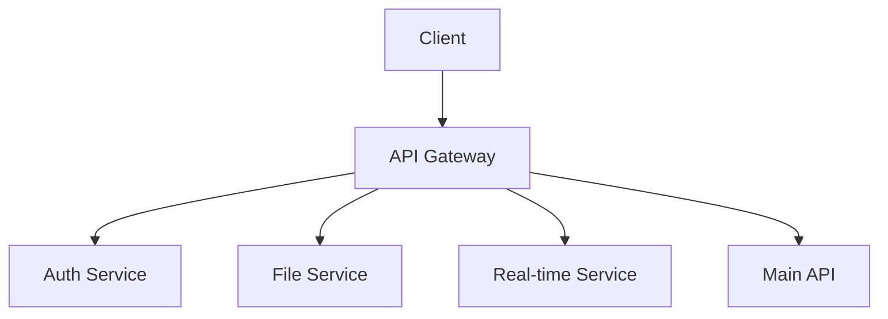
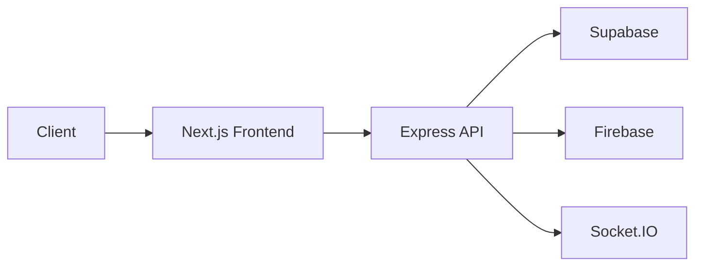

# This branch is for the web application of our project.

# Tech Stack Documentation

## Overview
This project is a full-stack web application built with modern technologies, focusing on security, scalability, and real-time capabilities. The application consists of multiple services working together to provide a comprehensive solution.

## Core Technologies

### Backend Services

#### 1. Main API Server (Express.js + Supabase)
- **Express.js**: Core web framework for building the REST API
  - Used for routing, middleware, and request handling
  - Implements security middleware (helmet, rate limiting)
  - Handles file uploads and processing

- **Supabase**: Backend-as-a-Service
  - Authentication and user management
  - Real-time database operations
  - File storage and management
  - Row Level Security (RLS) for data protection

#### 2. File Upload Service
- **FFmpeg**: Video processing
  - Converts uploaded videos to HLS format
  - Handles multiple resolutions
  - Optimizes video for streaming

- **Firebase Storage**: File storage
  - Stores processed video files
  - Manages file access and permissions
  - Generates secure download URLs

#### 3. Real-time Service (Socket.IO)
- **Socket.IO**: Real-time communication
  - Handles live updates and notifications
  - Manages user presence
  - Implements real-time chat features

### Frontend Technologies

#### 1. Web Application (Next.js)
- **Next.js**: React framework
  - Server-side rendering
  - API routes
  - File-based routing
  - Built-in optimizations

- **React**: UI library
  - Component-based architecture
  - State management
  - Virtual DOM for performance

#### 2. UI/UX
- **Tailwind CSS**: Utility-first CSS framework
  - Responsive design
  - Custom component styling
  - Dark mode support

- **Chart.js**: Data visualization
  - Interactive charts and graphs
  - Real-time data updates
  - Custom chart configurations

### Security Features

#### 1. Authentication & Authorization
- **JWT**: Token-based authentication
  - Secure user sessions
  - Token refresh mechanism
  - Role-based access control

- **bcrypt**: Password hashing
  - Secure password storage
  - Salt generation
  - Password verification

#### 2. Data Protection
- **AES-256-GCM**: Encryption
  - End-to-end encryption
  - Secure data transmission
  - Key management

- **Helmet**: Security headers
  - XSS protection
  - CSRF prevention
  - Content Security Policy

### Development Tools

#### 1. Testing
- **Jest**: Unit testing
  - Component testing
  - Service testing
  - Mock implementations

- **Supertest**: API testing
  - Endpoint testing
  - Integration testing
  - Response validation

#### 2. Documentation
- **Swagger**: API documentation
  - OpenAPI specification
  - Interactive API explorer
  - Request/response examples

## Service Architecture

### 1. API Gateway


### 2. Data Flow


## Development Setup

### Prerequisites
- Node.js (v16+)
- Python (v3.9+)
- FFmpeg
- Docker (optional)

### Environment Variables
```env
# Supabase
SUPABASE_URL=your_supabase_url
SUPABASE_ANON_KEY=your_supabase_anon_key

# Firebase
FIREBASE_PROJECT_ID=your_project_id
FIREBASE_PRIVATE_KEY=your_private_key
FIREBASE_CLIENT_EMAIL=your_client_email

# JWT
JWT_SECRET=your_jwt_secret
ENCRYPTION_KEY=your_encryption_key

# Server
PORT=5000
NODE_ENV=development
```

### Installation
```bash
# Install dependencies
npm install

# Start development servers
npm run dev

# Run tests
npm test

# Generate API documentation
npm run swagger-autogen
```

## Deployment

### Docker Deployment
```bash
# Build containers
docker-compose build

# Start services
docker-compose up -d
```

### Vercel Deployment
- Automatic deployments from main branch
- Environment variables configured in Vercel dashboard
- Custom build settings for Next.js

## Monitoring and Analytics

### 1. Performance Monitoring
- Real-time metrics
- Error tracking
- User behavior analytics

### 2. Security Monitoring
- Failed login attempts
- Suspicious activity detection
- Rate limit monitoring

## Contributing
1. Fork the repository
2. Create your feature branch
3. Commit your changes
4. Push to the branch
5. Create a Pull Request

## License
This project is licensed under the MIT License - see the LICENSE file for details.
